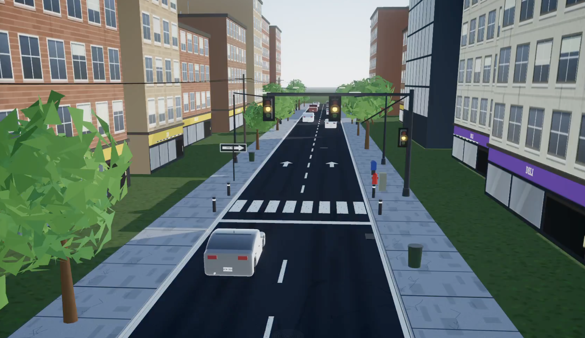

# Claude Fable 5 Traffic Light Simulation

A small single-file traffic light simulation created as a test of Claude Fable 5. The simulation lives entirely in `index.html`.

## Demo

Watch the demo here: [X post](https://x.com/diegocabezas01/status/2065050163228426719?s=46&t=SsiRKZ2Q9HeqSo2ULlEsyg)

## How To Open It

Option 1: download the full repo.

1. Download this repository from GitHub.
2. Unzip the downloaded file if needed.
3. Open the folder in your Downloads.
4. Double-click `index.html`, or right-click it and choose your browser.

Option 2: save only the HTML file.

1. Right-click this link: [`index.html`](https://raw.githubusercontent.com/diegocp01/fable-5-traffic-light-sim/main/index.html).
2. Choose "Save Link As..." or "Download Linked File As...".
3. Save it as `index.html` in your Downloads folder.
4. Open it from your Downloads folder in a browser.

No build step, install, or server is required. Just download and open the HTML file in a browser.
